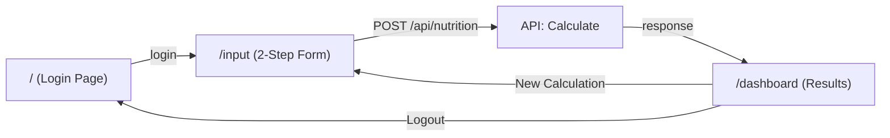

# 📊 Phân Tích Dự Án Smart Nutrition Advisor

## Tổng Quan Kiến Trúc

| Thành phần | Công nghệ |
|---|---|
| Framework | Next.js 16 (App Router) |
| UI Library | React 19 |
| Styling | Tailwind CSS 4 |
| Icons | lucide-react |
| Charts | chart.js + react-chartjs-2 |
| State Management | React Context API |
| Font | Google Fonts (Inter) |

---

## 1. API Routes (Server-Side)

Dự án chỉ có **1 API route** duy nhất:

### ✅ `POST /api/nutrition` — [route.js]

**Chức năng:** Nhận thông tin người dùng và trả về kết quả phân tích dinh dưỡng.

**Request body:**
```json
{
  "age": 25,
  "weight": 70,
  "height": 175,
  "goal": "lose" | "gain" | "maintain",
  "targetWeight": 65,    // optional
  "timeframe": 12        // optional, in weeks
}
```

**Response:**
```json
{
  "bmi": 22.9,
  "bmiCategory": { "label": "Normal", "color": "#22c55e", "bg": "#f0fdf4" },
  "calories": 1850,
  "macros": {
    "protein": { "grams": 162, "percentage": 35 },
    "carbs":   { "grams": 162, "percentage": 35 },
    "fat":     { "grams": 62,  "percentage": 30 }
  },
  "mealPlan": { "breakfast": {...}, "lunch": {...}, "dinner": {...}, "snack": {...} },
  "userInfo": { "age": 25, "weight": 70, "height": 175, "goal": "Lose Weight", ... }
}
```

**Xử lý bên trong:**
- Validate đầu vào (age: 1-120, weight: 20-300kg, height: 50-250cm)
- Tính BMI → `calculateBMI()`
- Phân loại BMI → `getBMICategory()` (Underweight / Normal / Overweight / Obese)
- Tính TDEE (lượng calo tiêu thụ) → `calculateTDEE()` dùng công thức **Mifflin-St Jeor**
- Tính macronutrients → `calculateMacros()` (Protein/Carbs/Fat theo %)
- Lấy meal plan → `getMealPlan()` (dữ liệu mock tĩnh)
- Mô phỏng delay 800ms (giả lập AI processing)

> [!NOTE]
> API này là **mock API** — tất cả logic tính toán chạy local bằng các hàm utility, không gọi bất kỳ external API nào (không có OpenAI, không có database).

---

## 2. Library Functions (Business Logic)

### [nutrition.js]

| Hàm | Chức năng | Trạng thái |
|---|---|---|
| `calculateBMI(weight, height)` | Tính chỉ số BMI | ✅ Hoàn thành |
| `getBMICategory(bmi)` | Phân loại BMI (4 nhóm) + trả màu sắc | ✅ Hoàn thành |
| `getBMIPercentage(bmi)` | Chuyển BMI → % để hiển thị thanh progress | ✅ Hoàn thành |
| `calculateTDEE(weight, height, age, goal, targetWeight, timeframe)` | Tính TDEE theo công thức Mifflin-St Jeor, hỗ trợ calorie deficit/surplus tùy chỉnh | ✅ Hoàn thành |
| `calculateMacros(calories, goal)` | Phân chia Protein/Carbs/Fat theo goal | ✅ Hoàn thành |

### [mealPlans.js]
| Hàm | Chức năng | Trạng thái |
|---|---|---|
| `getMealPlan(goal)` | Trả về meal plan (breakfast/lunch/dinner/snack) theo mục tiêu | ✅ Hoàn thành |
| `getTotalCalories(mealPlan)` | Tính tổng calories từ meal plan | ✅ Hoàn thành (chưa được sử dụng) |

> [!IMPORTANT]
> Dữ liệu meal plan là **hardcoded** (3 bộ plan cho lose/gain/maintain), mỗi bộ gồm 4 bữa với tên món, mô tả, calo, protein, carbs, fat, và danh sách nguyên liệu.

---

## 3. Pages (Frontend Routes)

| Route | File | Chức năng | Trạng thái |
|---|---|---|---|
| `/` | [page.js](../src/app/page.js) | Trang Login (mock auth) | ✅ Hoàn thành |
| `/input` | [page.js](../src/app/input/page.js) | Form nhập liệu (2 bước) | ✅ Hoàn thành |
| `/dashboard` | [page.js](../src/app/dashboard/page.js) | Trang kết quả phân tích | ✅ Hoàn thành |

**Luồng người dùng:** `Login → Input (Step 1: Body Metrics → Step 2: Goals) → Dashboard`

---

## 4. Components

| Component | File | Chức năng | Trạng thái |
|---|---|---|---|
| `Header` | [Header.js](../src/components/Header.js) | Navigation bar + logo + user info + logout | ✅ Hoàn thành |
| `Footer` | [Footer.js](../src/components/Footer.js) | Footer | ✅ Hoàn thành |
| `BMICard` | [BMICard.js](../src/components/BMICard.js) | Hiển thị BMI với thanh scale màu | ✅ Hoàn thành |
| `CaloriesCard` | [CaloriesCard.js](../src/components/CaloriesCard.js) | Hiển thị lượng calo hàng ngày + macro mini | ✅ Hoàn thành |
| `MealPlanTable` | [MealPlanTable.js](../src/components/MealPlanTable.js) | Bảng 4 bữa ăn dạng card | ✅ Hoàn thành |
| `NutritionChart` | [NutritionChart.js](../src/components/NutritionChart.js) | Biểu đồ Doughnut (Chart.js) cho macros | ✅ Hoàn thành |

---

## 5. State Management

### [AppContext.js] — React Context (Global State)

| State/Action | Mô tả | Trạng thái |
|---|---|---|
| `user`, `isAuthenticated` | Auth state | ✅ |
| `formData` | Dữ liệu form (age, weight, height, goal, targetWeight, timeframe) | ✅ |
| `result` | Kết quả từ API `/api/nutrition` | ✅ |
| `isLoading`, `error` | Loading và error states | ✅ |
| `login(email, password)` | Mock login (chấp nhận bất kỳ email + password ≥ 6 chars) | ✅ |
| `logout()` | Logout + reset toàn bộ state | ✅ |
| `updateFormData(field, value)` | Cập nhật field trong form | ✅ |
| `calculateNutrition(data)` | Gọi `POST /api/nutrition` và lưu kết quả | ✅ |
| `clearResult()` | Xóa kết quả để tính lại | ✅ |

---

## 6. Tính Năng Đặc Biệt Đã Hoàn Thành

| Tính năng | Chi tiết |
|---|---|
| 🔐 Form Validation | Client-side + Server-side validation (age, weight, height, targetWeight, timeframe) |
| 📊 Data Visualization | Biểu đồ Doughnut (Chart.js) cho phân bổ macronutrients |
| 🎨 UI/UX Premium | Glassmorphism, gradient backgrounds, micro-animations, hover effects |
| 📱 Responsive Design | Tailwind responsive classes (sm, md, lg breakpoints) |
| 🔄 Multi-step Form | Form 2 bước với animation chuyển trang |
| 💡 BMI Recommendations | Sau bước 1, hiển thị gợi ý dựa trên BMI tính được |
| 🍽️ Meal Plan Cards | 4 bữa ăn chi tiết với nguyên liệu và thông tin dinh dưỡng |
| 🛡️ Route Protection | Redirect về login nếu chưa đăng nhập, redirect về input nếu chưa có result |

---

## 7. Tổng Kết



### ✅ Đã hoàn thành:
- **1 API route** (`POST /api/nutrition`) với đầy đủ validation và business logic
- **3 pages** (Login, Input, Dashboard) với routing bảo vệ
- **6 components** tái sử dụng
- **5 utility functions** tính toán dinh dưỡng
- **Global state management** với React Context
- **Mock authentication**
- **Data visualization** với Chart.js
- **Responsive design** + **Premium UI**

### ⚠️ Lưu ý:
- Toàn bộ dự án sử dụng **mock data** — không kết nối database hay AI thực sự
- Authentication là **mock** (chấp nhận bất kỳ email/password)
- Meal plan là **static data** (3 bộ plan cố định)
- Hàm `getTotalCalories()` đã định nghĩa nhưng **chưa sử dụng** ở đâu
